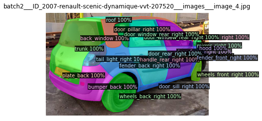
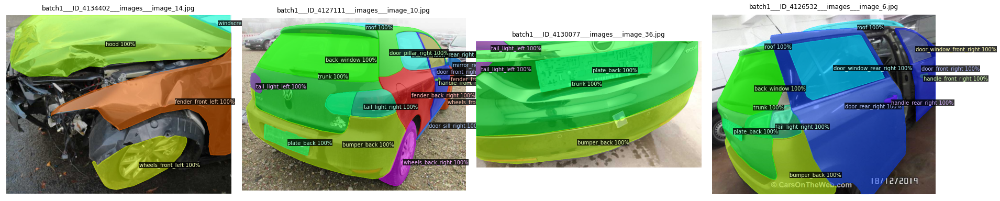
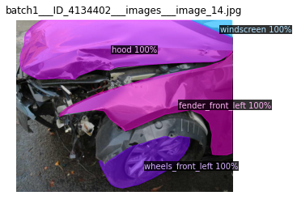
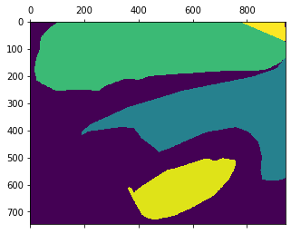

.. code:: ipython3

    import sys
    sys.path.append('..')

.. code:: ipython3

    %load_ext autoreload
    %autoreload 2

.. parsed-literal::

    The autoreload extension is already loaded. To reload it, use:
      %reload_ext autoreload

.. code:: ipython3

    from polimorfo.datasets import CocoDataset, SemanticCoco
    import matplotlib.pyplot as plt
    from polimorfo.utils import maskutils
    import numpy as np
    from skimage import measure

.. code:: ipython3

    ds = SemanticCoco('../../car-models/datasets/carparts_cropped_all/train_carparts_dataset.json')

.. parsed-literal::

    load categories: 100%|██████████| 42/42 [00:00<00:00, 141381.03it/s]
    load images: 100%|██████████| 8000/8000 [00:00<00:00, 1435238.12it/s]
    load annotations: 100%|██████████| 111876/111876 [00:00<00:00, 1191683.23it/s]

.. code:: ipython3

    ds.show_image(show_masks=True, show_boxes=False)

.. parsed-literal::

    <AxesSubplot:title={'center':'batch2___ID_2007-renault-scenic-dynamique-vvt-207520___images___image_4.jpg'}>

.. code:: ipython3

    fig = ds.show_images([481, 125, 101, 74])

.. code:: ipython3

    masks = ds.get_segmentation_mask(481)

.. code:: ipython3

    ds.show_image(481)

.. parsed-literal::

    <AxesSubplot:title={'center':'batch1___ID_4134402___images___image_14.jpg'}>

.. code:: ipython3

    plt.matshow(masks)

.. parsed-literal::

    <matplotlib.image.AxesImage at 0x7ff8892db690>

.. code:: ipython3

    ds.cats

.. parsed-literal::

    {1: {'supercategory': 'thing', 'id': 1, 'name': 'back_window'},
     2: {'supercategory': 'thing', 'id': 2, 'name': 'bumper_back'},
     3: {'supercategory': 'thing', 'id': 3, 'name': 'bumper_front'},
     4: {'supercategory': 'thing', 'id': 4, 'name': 'door_front_left'},
     5: {'supercategory': 'thing', 'id': 5, 'name': 'door_front_right'},
     6: {'supercategory': 'thing', 'id': 6, 'name': 'door_pillar_left'},
     7: {'supercategory': 'thing', 'id': 7, 'name': 'door_pillar_right'},
     8: {'supercategory': 'thing', 'id': 8, 'name': 'door_rear_left'},
     9: {'supercategory': 'thing', 'id': 9, 'name': 'door_rear_right'},
     10: {'supercategory': 'thing', 'id': 10, 'name': 'door_sill_left'},
     11: {'supercategory': 'thing', 'id': 11, 'name': 'door_sill_right'},
     12: {'supercategory': 'thing', 'id': 12, 'name': 'door_window_front_left'},
     13: {'supercategory': 'thing', 'id': 13, 'name': 'door_window_front_right'},
     14: {'supercategory': 'thing', 'id': 14, 'name': 'door_window_rear_left'},
     15: {'supercategory': 'thing', 'id': 15, 'name': 'door_window_rear_right'},
     16: {'supercategory': 'thing', 'id': 16, 'name': 'fender_back_left'},
     17: {'supercategory': 'thing', 'id': 17, 'name': 'fender_back_right'},
     18: {'supercategory': 'thing', 'id': 18, 'name': 'fender_front_left'},
     19: {'supercategory': 'thing', 'id': 19, 'name': 'fender_front_right'},
     20: {'supercategory': 'thing', 'id': 20, 'name': 'fog_light_front_left'},
     21: {'supercategory': 'thing', 'id': 21, 'name': 'fog_light_front_right'},
     22: {'supercategory': 'thing', 'id': 22, 'name': 'handle_front_left'},
     23: {'supercategory': 'thing', 'id': 23, 'name': 'handle_front_right'},
     24: {'supercategory': 'thing', 'id': 24, 'name': 'handle_rear_left'},
     25: {'supercategory': 'thing', 'id': 25, 'name': 'handle_rear_right'},
     26: {'supercategory': 'thing', 'id': 26, 'name': 'headlight_left'},
     27: {'supercategory': 'thing', 'id': 27, 'name': 'headlight_right'},
     28: {'supercategory': 'thing', 'id': 28, 'name': 'hood'},
     29: {'supercategory': 'thing', 'id': 29, 'name': 'mirror_left'},
     30: {'supercategory': 'thing', 'id': 30, 'name': 'mirror_right'},
     31: {'supercategory': 'thing', 'id': 31, 'name': 'plate_back'},
     32: {'supercategory': 'thing', 'id': 32, 'name': 'plate_front'},
     33: {'supercategory': 'thing', 'id': 33, 'name': 'radiator_grill'},
     34: {'supercategory': 'thing', 'id': 34, 'name': 'roof'},
     35: {'supercategory': 'thing', 'id': 35, 'name': 'tail_light_left'},
     36: {'supercategory': 'thing', 'id': 36, 'name': 'tail_light_right'},
     37: {'supercategory': 'thing', 'id': 37, 'name': 'wheels_back_left'},
     38: {'supercategory': 'thing', 'id': 38, 'name': 'wheels_back_right'},
     39: {'supercategory': 'thing', 'id': 39, 'name': 'wheels_front_left'},
     40: {'supercategory': 'thing', 'id': 40, 'name': 'wheels_front_right'},
     41: {'supercategory': 'thing', 'id': 41, 'name': 'windscreen'},
     42: {'supercategory': 'thing', 'id': 42, 'name': 'trunk'}}

compute the stats for the images

.. code:: ipython3

    import dataclasses
    from dataclasses import dataclass
    import numpy as np

.. code:: ipython3

    def compute_imgs_stats(cat_id):
        areas = []
        for img_idx in ds.index.catidx_to_imgidxs[cat_id]:
            img_meta = ds.imgs[img_idx]
            areas.append(img_meta['width'] * img_meta['height'])
        return np.percentile(areas, [0, 25, 50, 75, 100])
    
    def compute_cat_stats(cat_id):
        areas = []
        for ann_idx in ds.index.catidx_to_annidxs[cat_id]:
            ann = ds.anns[ann_idx]
            areas.append(ann['area'])
        return np.percentile(areas, [0, 25, 50, 75, 100])

.. code:: ipython3

    out_idx_dict = dict()
    out_catname_dict = dict()
    
    np.set_printoptions(suppress=True)
    for idx, cat_meta in ds.cats.items():
        print(cat_meta['name'])
        imgs_stats = compute_imgs_stats(idx)
        cat_stats = compute_cat_stats(idx)
        print('image', imgs_stats)
        print('cats', cat_stats)
        print('mean_ratio', ((cat_stats / imgs_stats)))
        print('--------------')
        out_catname_dict[cat_meta['name']] = round((cat_stats / imgs_stats)[3],3)
        out_idx_dict[idx] = round((cat_stats / imgs_stats)[3],3)

.. parsed-literal::

    back_window
    image [  51273.    194488.25  239112.    374943.   3000000.  ]
    cats [   1170.   18240.   28569.   45144. 1107195.]
    mean_ratio [0.02281903 0.09378459 0.11947957 0.1204023  0.369065  ]
    --------------
    bumper_back
    image [  51273.  200288.  254694.  399993. 3000000.]
    cats [     40.     38345.25   68548.5   118346.25 2496960.  ]
    mean_ratio [0.00078014 0.19145056 0.26914062 0.2958708  0.83232   ]
    --------------
    bumper_front
    image [  67032.  204000.  265370.  422928. 3000000.]
    cats [     48.   44255.   79600.  139527. 2101760.]
    mean_ratio [0.00071608 0.21693627 0.29995855 0.32990722 0.70058667]
    --------------
    door_front_left
    image [  76302.  207332.  265088.  410462. 3000000.]
    cats [    276.    16905.5   28531.    60882.  2886408. ]
    mean_ratio [0.00361721 0.08153831 0.10762841 0.14832555 0.962136  ]
    --------------
    door_front_right
    image [  67032.    209863.    269952.    415839.75 3000000.  ]
    cats [    144.   17670.   30302.   65511. 2972513.]
    mean_ratio [0.00214823 0.08419779 0.11224959 0.15753905 0.99083767]
    --------------
    door_pillar_left
    image [  51273.   198678.   252909.   403531.5 3000000. ]
    cats [    65.   6860.  15862.  32249. 833940.]
    mean_ratio [0.00126772 0.03452823 0.06271821 0.07991693 0.27798   ]
    --------------
    door_pillar_right
    image [  26700.   198369.   258137.5  408011.  3000000. ]
    cats [   140.     6644.75  15793.5   32869.5  693248.  ]
    mean_ratio [0.00524345 0.03349692 0.06118251 0.08056033 0.23108267]
    --------------
    door_rear_left
    image [  79449.    206988.75  268247.5   423309.5  3000000.  ]
    cats [    128.   14620.   27456.   67284. 2724480.]
    mean_ratio [0.0016111  0.07063186 0.10235324 0.15894753 0.90816   ]
    --------------
    door_rear_right
    image [  55944.  210255.  274816.  437920. 3000000.]
    cats [     85.    15485.    28865.    70983.5 2998500. ]
    mean_ratio [0.00151938 0.07364866 0.10503391 0.16209239 0.9995    ]
    --------------
    door_sill_left
    image [  76302.   208703.   268736.   419131.5 3000000. ]
    cats [    143.     8476.5   14600.    28554.  1844850. ]
    mean_ratio [0.00187413 0.04061513 0.05432841 0.06812659 0.61495   ]
    --------------
    door_sill_right
    image [  67032.   211658.5  271887.   415917.5 3000000. ]
    cats [    104.     8994.    14900.    31085.5 1424000. ]
    mean_ratio [0.0015515  0.04249298 0.05480218 0.07473958 0.47466667]
    --------------
    door_window_front_left
    image [  76302.   204048.   259246.5  400143.  3000000. ]
    cats [   195.   3952.   6683.  12796. 691698.]
    mean_ratio [0.00255563 0.01936799 0.02577855 0.03197857 0.230566  ]
    --------------
    door_window_front_right
    image [  67032.    205017.    265696.    411438.25 3000000.  ]
    cats [    36.    4125.    6982.   14247.5 811831. ]
    mean_ratio [0.00053706 0.02012028 0.02627815 0.03462853 0.27061033]
    --------------
    door_window_rear_left
    image [  76302.   202286.   254940.   398317.5 3000000. ]
    cats [     64.     2974.5    5895.5   12414.  1132524. ]
    mean_ratio [0.00083877 0.01470443 0.02312505 0.03116609 0.377508  ]
    --------------
    door_window_rear_right
    image [  55944.   203395.5  262656.   414411.5 3000000. ]
    cats [   112.   3082.   6318.  13023. 731119.]
    mean_ratio [0.002002   0.01515274 0.02405428 0.03142529 0.24370633]
    --------------
    fender_back_left
    image [  51273.   203841.   259063.5  399792.5 3000000. ]
    cats [    117.    7542.   26138.   62227. 2363680.]
    mean_ratio [0.0022819  0.03699943 0.10089418 0.15564824 0.78789333]
    --------------
    fender_back_right
    image [  51273.   204253.5  263568.   408160.5 3000000. ]
    cats [    105.    7185.   25920.   57277. 2524041.]
    mean_ratio [0.00204786 0.03517688 0.09834274 0.1403296  0.841347  ]
    --------------
    fender_front_left
    image [  76302.   203586.   259999.5  407153.5 3000000. ]
    cats [    154.      5250.5    19468.5    47737.25 1990465.  ]
    mean_ratio [0.0020183  0.02579008 0.07487899 0.11724632 0.66348833]
    --------------
    fender_front_right
    image [  67032.    203363.25  261633.    403832.   3000000.  ]
    cats [    240.    5460.   20252.   50460. 2764800.]
    mean_ratio [0.00358038 0.02684851 0.07740614 0.12495295 0.9216    ]
    --------------
    fog_light_front_left
    image [  67032.   198543.   255108.   390337.5 3000000. ]
    cats [   56.   476.   924.  2006. 66676.]
    mean_ratio [0.00083542 0.00239747 0.003622   0.00513914 0.02222533]
    --------------
    fog_light_front_right
    image [  67032.   194880.   244872.   370834.5 3000000. ]
    cats [    45.    460.    884.   1815. 156792.]
    mean_ratio [0.00067132 0.00236043 0.00361005 0.00489437 0.052264  ]
    --------------
    handle_front_left
    image [  76302.   203871.   263266.   404338.5 3000000. ]
    cats [   24.   168.   273.   560. 91322.]
    mean_ratio [0.00031454 0.00082405 0.00103697 0.00138498 0.03044067]
    --------------
    handle_front_right
    image [  82404.   205897.   266954.   410512.5 3000000. ]
    cats [    28.    168.    286.    630. 147026.]
    mean_ratio [0.00033979 0.00081594 0.00107135 0.00153467 0.04900867]
    --------------
    handle_rear_left
    image [  79449.  204585.  262104.  421806. 3000000.]
    cats [    16.    168.    351.    800. 145408.]
    mean_ratio [0.00020139 0.00082117 0.00133916 0.00189661 0.04846933]
    --------------
    handle_rear_right
    image [  55944.   205173.   268584.   416925.5 3000000. ]
    cats [    25.    170.    361.    800. 292545.]
    mean_ratio [0.00044688 0.00082857 0.00134409 0.00191881 0.097515  ]
    --------------
    headlight_left
    image [  67032.   194493.   249463.5  378389.5 3000000. ]
    cats [    39.     3777.5    9676.    20631.75 519042.  ]
    mean_ratio [0.00058181 0.01942229 0.03878724 0.05452517 0.173014  ]
    --------------
    headlight_right
    image [  67032.   196300.5  250563.   386647.  3000000. ]
    cats [    85.    3790.    9386.5  20452.  562128. ]
    mean_ratio [0.00126805 0.01930713 0.03746164 0.05289579 0.187376  ]
    --------------
    hood
    image [  67032.   203663.5  266137.5  430700.  3000000. ]
    cats [     25.     30013.5    52536.     89443.75 2128128.  ]
    mean_ratio [0.00037296 0.14736809 0.19740172 0.20767065 0.709376  ]
    --------------
    mirror_left
    image [  68142.    196824.    250272.    388976.25 3000000.  ]
    cats [    99.     896.    1749.5   3775.5 656363. ]
    mean_ratio [0.00145285 0.00455229 0.00699039 0.00970625 0.21878767]
    --------------
    mirror_right
    image [  55944.  199615.  259008.  399696. 3000000.]
    cats [     84.     900.    1792.    4085. 1566352.]
    mean_ratio [0.0015015  0.00450868 0.00691871 0.01022027 0.52211733]
    --------------
    plate_back
    image [  51273.   194658.   239592.   371353.5 3000000. ]
    cats [   297.    4344.5   6844.   10707.  204820. ]
    mean_ratio [0.00579252 0.02231863 0.02856523 0.02883237 0.06827333]
    --------------
    plate_front
    image [  67032.    196750.75  251843.5   396708.75 3000000.  ]
    cats [   259.   3420.   5925.  10030. 106113.]
    mean_ratio [0.00386383 0.0173824  0.02352652 0.02528303 0.035371  ]
    --------------
    radiator_grill
    image [  38781.  197685.  253000.  406638. 3000000.]
    cats [   114.     5582.25  12333.5   25880.   658999.  ]
    mean_ratio [0.00293958 0.02823811 0.04874901 0.06364383 0.21966633]
    --------------
    roof
    image [  55944.    194882.25  248086.    388943.   3000000.  ]
    cats [    192.    4554.    7099.   12211. 1313640.]
    mean_ratio [0.003432   0.02336796 0.02861508 0.03139535 0.43788   ]
    --------------
    tail_light_left
    image [  51273.    195515.25  242353.5   381713.25 3000000.  ]
    cats [     84.    2168.    7209.   14876. 1091970.]
    mean_ratio [0.00163829 0.01108865 0.02974581 0.03897166 0.36399   ]
    --------------
    tail_light_right
    image [  51273.    195984.75  244357.5   387540.   3000000.  ]
    cats [    52.    1928.5   7008.   15176.  431288. ]
    mean_ratio [0.00101418 0.00984005 0.02867929 0.03915983 0.14376267]
    --------------
    wheels_back_left
    image [  51273.    201319.75  252928.    387589.5  3000000.  ]
    cats [    290.    4455.   11625.   27383. 1321811.]
    mean_ratio [0.005656   0.02212898 0.0459617  0.07064949 0.44060367]
    --------------
    wheels_back_right
    image [  51273.   203530.5  262065.5  406446.  3000000. ]
    cats [    351.     4601.    12096.    26199.5 1427820. ]
    mean_ratio [0.00684571 0.02260595 0.0461564  0.06445998 0.47594   ]
    --------------
    wheels_front_left
    image [  76302.   205331.5  261363.   408566.  3000000. ]
    cats [   216.     4310.25  12355.5   27655.   939904.  ]
    mean_ratio [0.00283086 0.02099166 0.04727333 0.06768796 0.31330133]
    --------------
    wheels_front_right
    image [  67032.   204322.5  263361.5  405653.  3000000. ]
    cats [    286.      4456.     12480.     27198.75 1235820.  ]
    mean_ratio [0.00426662 0.02180866 0.04738734 0.0670493  0.41194   ]
    --------------
    windscreen
    image [  67032.   201959.5  263344.   418435.  3000000. ]
    cats [    462.     18855.25   28211.     46568.5  2441880.  ]
    mean_ratio [0.00689223 0.09336154 0.10712604 0.11129208 0.81396   ]
    --------------
    trunk
    image [  51273.    196836.75  243711.5   383033.25 3000000.  ]
    cats [     84.    41890.    69419.   112526.5 2125236. ]
    mean_ratio [0.00163829 0.21281595 0.28484089 0.29377737 0.708412  ]
    --------------

.. code:: ipython3

    out_catname_dict['wheel_rear_right'] = out_catname_dict['wheels_back_right']
    del out_catname_dict['wheels_back_right']

.. code:: ipython3

    out_catname_dict

.. parsed-literal::

    {'bumper_back': 0.296,
     'bumper_front': 0.33,
     'door_front_left': 0.148,
     'door_front_right': 0.158,
     'door_pillar_left': 0.08,
     'door_pillar_right': 0.081,
     'door_rear_left': 0.159,
     'door_rear_right': 0.162,
     'door_window_front_left': 0.032,
     'door_window_front_right': 0.035,
     'door_window_rear_left': 0.031,
     'door_window_rear_right': 0.031,
     'fender_front_left': 0.117,
     'fender_front_right': 0.125,
     'handle_front_left': 0.001,
     'handle_front_right': 0.002,
     'handle_rear_left': 0.002,
     'handle_rear_right': 0.002,
     'headlight_left': 0.055,
     'headlight_right': 0.053,
     'hood': 0.208,
     'mirror_left': 0.01,
     'mirror_right': 0.01,
     'plate_back': 0.029,
     'plate_front': 0.025,
     'radiator_grill': 0.064,
     'roof': 0.031,
     'wheels_front_left': 0.068,
     'wheels_front_right': 0.067,
     'windscreen': 0.111,
     'back_side': 0.294,
     'window_back': 0.12,
     'sill_left': 0.068,
     'sill_right': 0.075,
     'fender_rear_left': 0.156,
     'fender_rear_right': 0.14,
     'foglight_left': 0.005,
     'foglight_right': 0.005,
     'taillight_left': 0.039,
     'taillight_right': 0.039,
     'wheel_rear_left': 0.071,
     'wheel_rear_right': 0.064}

.. code:: ipython3

    import json

.. code:: ipython3

    with open('name_avgarea_dict.json', 'w') as f:
        json.dump(out_catname_dict, f)

.. code:: ipython3

    idx_carpart_dict = {
      "1": "window_back",
      "2": "bumper_back",
      "3": "bumper_front",
      "4": "door_front_left",
      "5": "door_front_right",
      "6": "pillar_left",
      "7": "pillar_right",
      "8": "door_rear_left",
      "9": "door_rear_right",
      "10": "sill_left",
      "11": "sill_right",
      "12": "door_window_front_left",
      "13": "door_window_front_right",
      "14": "door_window_rear_left",
      "15": "door_window_rear_right",
      "16": "fender_rear_left",
      "17": "fender_rear_right",
      "18": "fender_front_left",
      "19": "fender_front_right",
      "20": "foglight_left",
      "21": "foglight_right",
      "22": "handle_front_left",
      "23": "handle_front_right",
      "24": "handle_rear_left",
      "25": "handle_rear_right",
      "26": "headlight_left",
      "27": "headlight_right",
      "28": "hood",
      "29": "mirror_left",
      "30": "mirror_right",
      "31": "plate_back",
      "32": "plate_front",
      "33": "radiator_grill",
      "34": "roof",
      "35": "taillight_left",
      "36": "taillight_right",
      "37": "wheel_rear_left",
      "38": "wheel_rear_right",
      "39": "wheels_front_left",
      "40": "wheels_front_right",
      "41": "windscreen",
      "42": "back_side"
    }

.. code:: ipython3

    carpart_idx_dict = {v:int(k) for k,v in idx_carpart_dict.items()}

.. code:: ipython3

    carpart_idx_dict

.. parsed-literal::

    {'window_back': 1,
     'bumper_back': 2,
     'bumper_front': 3,
     'door_front_left': 4,
     'door_front_right': 5,
     'pillar_left': 6,
     'pillar_right': 7,
     'door_rear_left': 8,
     'door_rear_right': 9,
     'sill_left': 10,
     'sill_right': 11,
     'door_window_front_left': 12,
     'door_window_front_right': 13,
     'door_window_rear_left': 14,
     'door_window_rear_right': 15,
     'fender_rear_left': 16,
     'fender_rear_right': 17,
     'fender_front_left': 18,
     'fender_front_right': 19,
     'foglight_left': 20,
     'foglight_right': 21,
     'handle_front_left': 22,
     'handle_front_right': 23,
     'handle_rear_left': 24,
     'handle_rear_right': 25,
     'headlight_left': 26,
     'headlight_right': 27,
     'hood': 28,
     'mirror_left': 29,
     'mirror_right': 30,
     'plate_back': 31,
     'plate_front': 32,
     'radiator_grill': 33,
     'roof': 34,
     'taillight_left': 35,
     'taillight_right': 36,
     'wheel_rear_left': 37,
     'wheel_rear_right': 38,
     'wheels_front_left': 39,
     'wheels_front_right': 40,
     'windscreen': 41,
     'back_side': 42}

.. code:: ipython3

    with open('carpart_idx_dict.json', 'w') as f:
        json.dump(carpart_idx_dict,f)

.. code:: ipython3

    !open .

